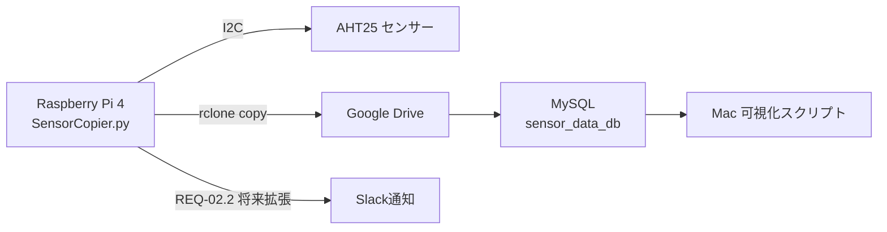

# SYS.2 システムアーキテクチャ設計書
**プロジェクト**：PiPulse Pipeline  
**最終更新**：2025-12-06（Hideo, Grok & Gemini 共同確定）  
**トレース元**：docs/system_requirements.md（全REQ対応）

### 改訂履歴
| 日付         | 変更者               | 変更内容                                           |
|--------------|----------------------|----------------------------------------------------|
| 2025-12-06   | Hideo, Grok, Gemini  | 用語集を追加し、ドキュメント全体の書式を最終FIX。    |
| 2025-12-06   | Hideo, Grok, Gemini  | 全ドキュメントと整合性を取るFIX。ハードウェア名を`RPi 4`に統一。 |
| 2025-12-06   | Hideo, Grok, Gemini  | 旧system-design.mdをSYS.2正式成果物に昇格。        |

### 1. 用語集（本ドキュメント固有）
- **システムコンテキスト図**: システムとその外部環境（ユーザー、他システム等）との境界と相互作用を定義する図。
- **論理アーキテクチャ図**: システムを構成する主要な論理コンポーネント（機能部品）と、それらの間のデータフローや連携を示す図。

### 2. システムコンテキスト図


### 2. 論理アーキテクチャ図（旧system-design.mdより完全継承）

```mermaid
graph TD
    subgraph "Raspberry Pi 4"
        cron[cron 15分間隔] --> P[SensorCopier.py]
        P --> R[AHT25センサー読み取り]
        R --> T[柔軟タイムスタンプパース<br>（INC-005対応）]
        T --> W[最新JSON + 月次JSON書き込み<br>（JST統一・INC-002対応）]
        W --> U[rclone copy同期<br>（INC-001対応）]
        U -->|失敗時| Slack[Slackアラート<br>(REQ-02.2 将来拡張)]
    end
    W --> Drive[Google Drive]
```

### 3. 要件トレーサビリティ（SYS.1 → SYS.2）

|対応要件    |実装コンポーネント（図参照）                     |教訓適用   |
|--------|-----------------------------------|-------|
|REQ-01  |AHT25センサー読み取り + cron               |-      |
|REQ-01.1|柔軟タイムスタンプパース                       |INC-005|
|REQ-02  |rclone copy同期                      |INC-001|
|REQ-02.1|月次JSON自動切替 + JST統一                 |INC-002|
|REQ-02.2|Slackアラート（将来拡張）                    |-      |
|REQ-03  |Google Drive → MySQL sensor_data_db|-      |
|REQ-03.1|可視化スクリプト（192件<10秒）                 |-      |
|REQ-04  |GitHub Actions CI/CD               |-      |
|REQ-04.2|旧月データアーカイブ（将来拡張）                   |-      |

### 4. 教訓適用状況（詳細は docs/lessons-learned.md 参照）

|INC番号  |内容           |本設計での対策              |
|-------|-------------|---------------------|
|INC-001|rclone sync誤用|rclone copy採用、データ損失ゼロ|
|INC-002|タイムゾーン移行ミス   |すべてのタイムスタンプをJSTに統一   |
|INC-005|データ形式混在      |柔軟パース関数で秒有無両対応       |