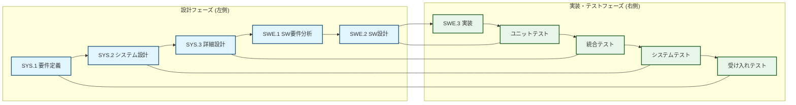

## PiPulse Pipeline: V-Model Master Guideline

**最終更新:** 2025-10-31

### 改訂履歴
| 日付 | 変更者 | 変更内容 | 関連 |
|---|---|---|---|
| 2025-10-31 | Hideo (assisted by Gemini/Grok) | Grokレビューの指摘を反映し、トレーサビリティの教訓をMAN.1等に追記。 | - |
| 2025-10-27 | Hideo (assisted by Gemini/Grok) | Mermaid修正、SYS.2整合性向上などGrokレビューを反映。 | - |
| 2025-10-26 | Hideo (assisted by Gemini) | バージョン管理一元化のため、バージョン番号を削除。 | - |
| 2025-10-23 | Hideo (Gemini assist) | 用語集/テーブル/Mermaid改善、SUP/MAN全展開による網羅性向上。 | PR #12, #13 (v1.2.3参照) |
| 2025-10-22 | Hideo (Gemini assist) | 初期バージョン作成。 | - |

---

### 用語集
- **7月データ**: 過去のセンサーデータ（192件）。テストや要件定義のベースラインとして使用。タイムスタンプ形式は `%Y-%m-%d %H:%M`（秒なし）。`REQ-01.1`のベースライン形式。
- **Drive**: Google Drive。
- **MAN**: Management Process (マネジメントプロセス)
- **[REQ-02]**: 主要横断要件「リアルタイム更新（処理時間<1min目標）」。センサーデータ取得からGoogle Driveへのアップロードまでの一連の処理を指す。
- **SUP**: Support Process (サポートプロセス)
- **SWE**: Software Development (ソフトウェア開発)
- **SYS**: System Definition (システム定義)
- **V&V**: Verification & Validation (検証と妥当性確認)

### V字プロセス全体像

### システム設計 (System Definition - SYS)
| プロセスID | 優先度 | ステータス | TODO | 完了基準 | Notes (成果物) |
|---|---|---|---|---|---|
| SYS.1 | High | [x] | [REQ-01], [REQ-02] 要件の具体化 | 要件リストにID追加、Gemini評価OK | [requirements.md](requirements.md) (`REQ-01`は7月データで検証済) |
| SYS.2 | Medium | [ ] | データフロー図更新 (タイムゾーン互換性含む移行ステップ記述) | テキスト図で[REQ-02]レイヤー記述 | [system-design.md](system-design.md) (タイムゾーン移行事例参照) |
| SYS.3 | Medium | [p] | [REQ-02] グラフ仕様追加 (折れ線, 異常値ハイライト) | I/F定義書にフォーマット記述 | [detailed-design.md](detailed-design.md) |

### ソフトウェア開発 (Software Development - SWE)
| プロセスID | 優先度 | ステータス | TODO | 完了基準 | Notes (成果物) |
|---|---|---|---|---|---|
| SWE.1 | Low | [ ] | [REQ-02] トレーサビリティ表拡張 | SYS.1とリンク、派生要件5件以上 | sw-requirements.md |
| SWE.2 | Medium | [p] | [REQ-02] 関数図追加 (main → plot_data) | テキストUMLでフロー描画 | sw-design.md |
| SWE.3 | High | [p] | [REQ-02] Apps Script作成 (同期処理) | スクリプト実行でデータ同期 | implementation.md |

### テスト & 検証 (Verification & Validation)
| プロセスID | 優先度 | ステータス | TODO | 完了基準 | Notes (成果物) |
|---|---|---|---|---|---|
| V&V.1 | Medium | [ ] | [REQ-02] 異常値抽出テスト (pytest)。データ形式混在テスト追加 (`INC-005`参照)。 | カバレッジ80%超え | unit-tests.md |
| V&V.2 | Medium | [ ] | [REQ-02] E2Eテスト (Docker, iPhone表示) | テスト実行でグラフ表示成功 | [integration-tests.md](integration-tests.md) |
| V&V.3 | Low | [p] | [REQ-02] スケジュールテスト (処理時間<10s) | ログで平均8s以内 | [system-tests.md](system-tests.md) |
| V&V.4 | Low | [p] | [REQ-02] グラフ比較 (7月データ) | グラフツールで192件推移表示OK | acceptance-tests.md |

### サポートプロセス (Support Process - SUP)
| プロセスID | 優先度 | ステータス | TODO | 完了基準 | Notes (成果物) |
|---|---|---|---|---|---|
| SUP.1 | High | [ ] | Actions ci.ymlでpytest追加 ([REQ-02]含む) | GitHub ActionsでSuccessバッジ | [qa-plan.md](qa-plan.md) |
| SUP.2 | Low | [ ] | PRでCodeQLスキャン | PRマージでセキュリティクリア | [verification.md](verification.md) |
| SUP.3 | Medium | [ ] | [REQ-02] 共有リンクテスト (iPhone表示) | iPhoneアプリでリアルタイムグラフ表示 | validation.md |
| SUP.4 | Low | [ ] | [REQ-02] 改善案をGemini評価 | フィードバック3つ以上反映 | [joint-review.md](joint-review.md) |
| SUP.5 | Medium | [ ] | Slackアラート追加 ([REQ-02]グラフ失敗) | テストエラーでSlack通知到着 | [audit.md](audit.md) |
| SUP.6 | High | [ ] | deploy.yml作成 (SSH + systemd, [REQ-02]同期) | mainプッシュでラズパイ再起動 | [product-acceptance.md](product-acceptance.md) |
| SUP.7 | Low | [p] | Dependabot PR設定 | 自動PR生成、ライブラリ更新1件適用 | [configuration.md](configuration.md) |
| SUP.8 | Low | [ ] | Issuesテンプレートで[REQ-02]リクエスト | Issue作成&クローズ、変更履歴トレース | [change-request.md](change-request.md) |
| SUP.9 | Medium | [p] | 自動Issue作成 (テスト失敗) | テスト失敗でIssue生成、解決後クローズ | [problem-resolution.md](problem-resolution.md) |
| SUP.10 | Low | [ ] | Insightsで[REQ-02]処理時間レビュー | ダッシュボードで平均時間表示 | [process-improvement.md](process-improvement.md) |

### マネジメントプロセス (Management Process - MAN)
| プロセスID | 優先度 | ステータス | TODO | 完了基準 | Notes (成果物) |
|---|---|---|---|---|---|
| MAN.1 | Medium | [ ] | `RISKS.md`作成 + トレーサビリティチェックのルール化 | リスクリスト5件以上。教訓: 用語集（7月データ形式）と要件（REQ-01.1）の不整合を見落とした。月1回のAIレビューで上位・下位文書の一貫性を確保する。 | project-management.md |

---
*凡例: ステータス [x]=完了, [p]=一部完了, [ ]=未着手*
